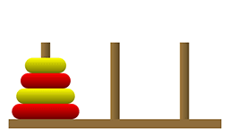

# Tower of Hanoi
    

## Explanation
The Tower of Hanoi problem involves moving a tower of `n` disks from the **source peg** to the **destination peg**, using an **auxiliary peg**. The rules of the problem are:

1. Only one disk can be moved at a time.
2. A larger disk cannot be placed on top of a smaller disk.
3. The tower of disks must be moved from the source peg to the destination peg.

### Example: Tower of Hanoi with 3 Disks
Initially, all 3 disks are on the source peg (**A**), with the largest disk at the bottom and the smallest disk at the top. The goal is to move the entire tower to the destination peg (**C**), using the auxiliary peg (**B**) as needed.

#### Steps to Solve:
1. Move disk 1 from A to C
2. Move disk 2 from A to B
3. Move disk 1 from C to B
4. Move disk 3 from A to C
5. Move disk 1 from B to A
6. Move disk 2 from B to C
7. Move disk 1 from A to C

After these 7 moves, the entire tower of disks has been successfully moved from the source peg to the destination peg, following the rules.

### Mathematical Insight:
The minimum number of moves required to solve the Tower of Hanoi problem with `n` disks is calculated as:

\[
\text{Moves} = 2^n - 1
\]

For example, for 3 disks:
\[
\text{Moves} = 2^3 - 1 = 7
\]

---

## Implementation
This repository contains code to solve the Tower of Hanoi problem programmatically. The implementation uses recursion to model the step-by-step solution.

### Features:
- Supports any number of disks.
- Visualizes the sequence of moves.

### File Structure:
- `tower_of_hanoi.py`: Python implementation of the Tower of Hanoi algorithm.
- `README.md`: Explanation and usage details.

### How to Run:
1. Clone this repository.
2. Run the `tower_of_hanoi.py` file using Python.
3. Input the number of disks when prompted.

### License:
This project is licensed under the MIT License. See the `LICENSE` file for details.

---

Happy Coding!
